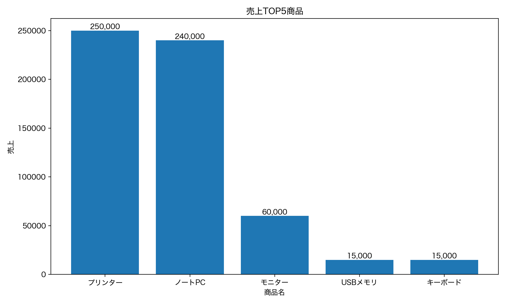

# Excel 売上レポート自動作成ツール

## 概要
複数の Excel（.xlsx）ファイルを読み込み、  
日別売上・商品別売上・売上TOP5 を自動で集計し、  
ExcelおよびCSV形式でレポートを出力する Python ツールです。

Excelでの手作業集計を自動化することを目的としています。

---

## 想定利用シーン

- 毎月・毎週の売上データを複数のExcelで管理している
- 手作業で集計・転記しており、時間がかかっている
- 日別・商品別・売上上位商品のレポートを自動で作成したい

本ツールを使うことで、  
Excelファイルを input フォルダに入れて実行するだけで  
集計・レポート作成・グラフ生成までを自動化できます。

## フォルダ構成

```
excel_auto_report/
├─ input/      # 集計対象のExcel（.xlsx）を入れるフォルダ
├─ output/     # 自動生成されたレポート・CSV・グラフの出力先
├─ main.py     # 集計処理を実行するメインスクリプト
└─ README.md   # 本ツールの概要・使い方
```

## 機能

- 複数のExcelファイル（.xlsx）を自動で結合
- 日別売上の集計
- 商品別売上の集計
- 売上TOP5商品の自動抽出
- 集計結果をExcel（複数シート）で出力
- 集計結果をCSV形式でも出力

## 工夫したポイント / 学び

- **Excel手作業の自動化を強く意識**
  - 複数のExcelファイルを一括で読み込み、  
    日別・商品別・売上TOP5までを「1コマンド」で生成できる構成にしました。
  - 実務でありがちな「毎回同じ集計を繰り返す作業」を想定しています。

- **フォルダ分離による運用しやすさ**
  - `input / output` を明確に分けることで、
    Excelを入れ替えるだけで再集計できるように設計しました。
  - スクリプト修正なしで運用できる点を重視しています。

- **Excel・CSV・グラフの複数形式で出力**
  - Excel（複数シート）だけでなく、CSV・PNGグラフも自動生成。
  - 分析用途・共有用途の両方を想定しました。

- **READMEを重視したポートフォリオ設計**
  - 初見の人でも「何ができて、どう使うか」が分かるよう、
    フォルダ構成・実行例・出力例をREADMEに明記しました。

- **エラー対応を通じた理解の深化**
  - pandas / matplotlib / GitHub連携で発生したエラーを一つずつ解消し、
    Python環境構築から実行までの流れを体系的に理解できました。
---

## 出力内容

### Excelファイル
- 結合データ
- 日別売上
- 商品別売上
- 売上TOP5

### CSVファイル
- daily_sales.csv（日別売上）
- product_sales.csv（商品別売上）
- top5_products.csv（売上TOP5）
---

## 売上TOP5グラフ（自動生成）



---

## 売上TOP5グラフ（自動生成）


---

## 使い方

1. `input/` フォルダに集計したいExcel（.xlsx）を入れる
2. 依存ライブラリをインストール
※ output フォルダにレポートファイルが生成されていれば正常に実行されています。

```bash
pip3 install pandas openpyxl matplotlib
```

## 実行例（Before / After）

### Before（input/ にExcelを入れる）
- input/ に複数の売上Excel（.xlsx）を配置します  
  （列：日付 / 商品名 / 単価 / 数量 / 売上）

例：
- input/sales_2025_08_01.xlsx
- input/sales_2025_08_02.xlsx
- input/sales_2025_08_03.xlsx

### Run（実行）
```bash
python3 main.py
```
---

## 今後の改善アイデア

- 売上推移を可視化するため、日別売上の折れ線グラフを追加
- 期間指定（例：特定月・特定週）で集計できる機能の追加
- CSV / Excel の出力ON・OFFを引数で切り替えられるように改善
- データ件数や合計売上をサマリーとして冒頭に表示